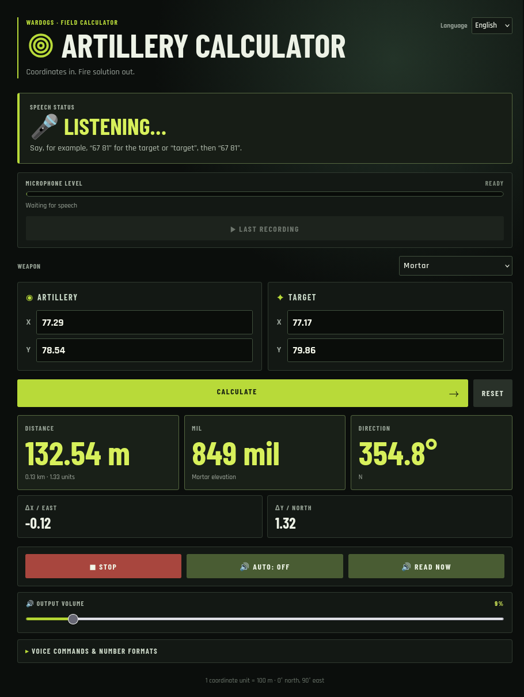

# WARDOGS Artillery Calculator

A browser-based coordinate calculator for WARDOGS. It calculates distance, coordinate differences, and azimuth entirely in the browser.

Try it: https://stiffi136.github.io/wardogs-artillery-calculator/



## User Guide

### Entering coordinates

Enter complete artillery and target coordinates in the input fields. The fire solution updates immediately. The selected language, most recently used coordinates, and output volume are saved locally in your browser; no personal data is collected.

One coordinate unit equals 100 metres. The azimuth is calculated with `atan2(deltaX, deltaY)`: 0° is north and 90° is east. Matching artillery and target coordinates show an azimuth of 0°.

Choose the appropriate weapon and, for mortars, the desired trajectory. The calculator reports when the target is outside the selected weapon's range.

### Voice control

Select English or German in the application, then start voice control and allow microphone access when prompted. The app runs speech recognition locally with Whisper; recorded audio is not sent to a server or stored permanently.

English voice-command examples:

- `Artillery 45 32, target 67 81`
- `Gun 45 32 target 67 81`
- `Artillery 45 32`
- `Target 67 81`
- `67 81` — without a command, this is used as the target coordinate
- `Calculate`, `result`, `read`, `reset`, or `stop`

You can also give coordinates step by step: say `target`, then `67 81`; or say `artillery`, then `45 32`. Number words and decimal values such as `forty five thirty two` and `45 point 32` are supported. Incomplete coordinate pairs are ignored.

Voice control requires a modern browser with microphone access, Web Workers, Web Audio, and Speech Synthesis. WebGPU is preferred; if it is unavailable, Transformers.js uses WASM/CPU instead. The first Whisper download is about 300 MB, so loading may take some time depending on the device and connection.

## Developer Guide

### Local development

```bash
npm install
npm run dev
```

Other useful commands:

```bash
npm run build
npm run lint
npm run preview
```

### Local Whisper model

The calculator works without the model, but voice control requires the model files at `public/models/onnx-community/whisper-base/`. Download them with:

```bash
npm run download:model
```

The model is intentionally not committed to Git: GitHub rejects ordinary files above 100 MiB, and Git LFS is not compatible with GitHub Pages. The browser caches the model after it has been downloaded.

### GitHub Pages deployment

The workflow in `.github/workflows/deploy-pages.yml` downloads the required files from `onnx-community/whisper-base` into `public/models/`, then publishes them with the Vite build. Before the first deployment, set **Pages** to use **GitHub Actions** in the repository settings. Every push to `main` then deploys the static app and model; the browser fetches the model from the same GitHub Pages domain.

### Project structure

- `src/logic/calculator` — coordinate validation, central map configuration, and azimuth/distance calculation.
- `src/logic/speech` — microphone recording, RMS VAD with a 500 ms pre-roll, speech session, Whisper web worker, command parser, and speech output.
- `src/App.tsx` — responsive UI and application state.
